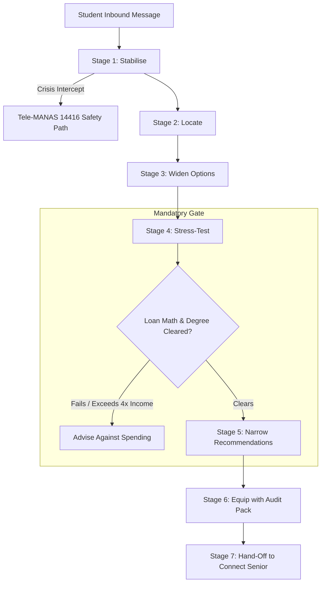

# Campus Critique: Project Requirements Document (PRD)
## Autonomous WhatsApp Decision Infrastructure for Engineering Aspirants

**Document Status:** Approved Product Specification & Academic Defense Baseline  
**Project Code:** CC-WABA-2026  
**Target Release:** June 2027 Counselling Cycle (Private Pilot: December 2026)  
**Authors:** Campus Critique Product & Engineering Team  
**Reviewer / Evaluator:** Academic Supervisor & Project Examination Committee  

---

### Executive Summary

Every year in India, approximately **14.5 to 16 lakh candidates** register for the Joint Entrance Examination (JEE Main). However, the joint seat allocation process (JoSAA) across all premier public technical institutions—including all Indian Institutes of Technology (IITs), National Institutes of Technology (NITs), Indian Institutes of Information Technology (IIITs), and Government Funded Technical Institutions (GFTIs)—offers only **67,323 total seats**. Consequently, over **95% of aspirants (~13 to 15 lakh students annually)** do not secure a JoSAA seat. Within an intense, high-stress six-week window between score announcements and admission deadlines, these seventeen- and eighteen-year-old students are compelled to make financial commitments ranging from **₹8 lakh to ₹28 lakh**. 

Compounding this crisis, the current educational advisory ecosystem is structurally compromised. College discovery portals, YouTube influencers, and educational consultancies operate on commercial referral models, earning **₹20,000 to ₹60,000 per closed admission**. Thus, vulnerable students and low-to-middle-income parents navigate this critical milestone surrounded almost exclusively by agents with a direct financial stake in directing their choices toward high-commission private institutions.

**Campus Critique WhatsApp Bot** is an autonomous, conversational decision-support infrastructure engineered to eliminate this asymmetric conflict of interest. Designed from first principles as an **independent advisory system**, its operational mandate explicitly prohibits per-admission monetization. Its conversational architecture implements an empathetic **7-stage advisory framework**—handling emotional distress, profiling academic and geographic constraints, widening option horizons, stress-testing loan affordability against parental income, deterministic college matching with mandatory institutional caveats, equipping students with an audit question pack, and routing to independent student mentors.

---

## 1. Problem Statement & The Indian Engineering Education Landscape

### 1.1 The Macro Admission Funnel
The Indian engineering entrance ecosystem presents an extreme imbalance between supply and demand:

| Funnel Metric | Quantitative Data | Analytical Implication |
|---|---|---|
| **JEE Main Registrations** | ~14,50,000 to 16,00,000 | Record candidate volume; intensifying percentile competition. |
| **Total JoSAA Allocated Seats** | 67,323 (IITs, NITs, IIITs, GFTIs) | Only 4.2% to 4.6% of test-takers obtain a subsidized public seat. |
| **Unplaced Candidates (JoSAA Miss)** | **~13,80,000 to 15,30,000 (~95%)** | **The Core Target Demographic:** Students needing alternative pathways. |
| **Drop-Year Rank Improvement Rate** | 20% to 30% | Dropping a year is statistically unfavorable for ~70%+ of aspirants. |
| **Decision Window** | 4 to 6 Weeks (June – July) | High urgency, compressed evaluation window, vulnerable state. |

### 1.2 The Emerging "New-Age" Tech Institution Paradigm
An empirical audit of the eight prominent new-age institutions on the Campus Critique tracking platform reveals significant informational asymmetries:

| Institution | Est. | 4-Year Total Cost | Typical Batch | Documented Placement History | Degree Granting Vehicle |
|---|---|---|---|---|---|
| **Newton School (ADYPU)** | 2024 | ₹17.5L – ₹26.9L | ~100 | Early internship signals only | Ajeenkya DY Patil University (ADYPU) |
| **Newton School (Rishihood)** | 2023 | ₹17.5L – ₹26.9L | ~120 | Internships documented; full batch graduating | Rishihood University |
| **Scaler School of Tech (SST)** | 2023 | ₹17.0L – ₹24.5L | ~60 – 80 | 96.3% audited tech internships | Partner HEI degree (Requires student verification) |
| **Vedam** | 2025 | ₹18.0L | ~60 – 80 | **None** (Inaugural cohorts) | ADYPU |
| **Intellipaat IST** | 2025 | ₹16.0L | 63 | **None** (24 unpaid training internships) | S-VYASA (Deemed-to-be University) |
| **NIAT** | 2023 | ₹8.0L – ₹18.0L | ~80 | 8.5 LPA reported average; 24 LPA highest | ADYPU |
| **Veloces** | 2024 | ₹10.0L – ₹16.0L | Unspecified | **None** (Zero graduating batches) | ADYPU |
| **Alta School of Tech** | 2026 | ₹9.8L – ₹15.0L | Unspecified | **None** (Newest entrant) | ADYPU |

---

## 2. Competitive Landscape & Market Differentiation

```
┌────────────────────────────────────────────────────────────────────────┐
│                   COMPETITIVE ANALYSIS & DIFFERENTIATION               │
├──────────────────────┬──────────────────────┬──────────────────────────┤
│ Platform / Player    │ Monetization Model   │ Critical Structural Flaw │
├──────────────────────┼──────────────────────┼──────────────────────────┤
│ Aggregator Portals   │ Referral kickbacks   │ Ranks colleges by lead   │
│ (Shiksha, Collegedunia) (₹20k–₹60k / seat)  │ fees, not student fit    │
├──────────────────────┼──────────────────────┼──────────────────────────┤
│ YouTube Reviewers    │ Brand sponsorships   │ Highlight top package    │
│ & Influencers        │ & affiliate links    │ outliers; conceal debt   │
├──────────────────────┼──────────────────────┼──────────────────────────┤
│ Coaching Counselors  │ Drop-year course     │ Push repeat attempts even│
│                      │ enrollment quotas    │ when odds are &lt;20%     │
├──────────────────────┼──────────────────────┼──────────────────────────┤
│ Campus Critique Bot  │ Independent Trust &  │ ONLY party capable of    │
│ (This Project)       │ ₹99 Senior Calls     │ advising against spend!  │
└──────────────────────┴──────────────────────┴──────────────────────────┘
```

---

## 3. Product Vision & Locked Decision D1

### Decision D1: Complete Independence from Admissions
The primary mandate of Campus Critique WhatsApp Bot is **Decision Infrastructure**:
> **The bot's performance metrics and financial incentives must never be tied to college admissions.**

Operationally, this means:
- No referral fee, cost-per-lead (CPL), or cost-per-acquisition (CPA) contracts with colleges.
- Recommendation algorithms possess no metadata attribute representing commercial relationships.
- The bot must possess the structural capability and conversational duty to state:  
  *"Based on your family's annual income and risk parameters, you should not spend ₹18–24 lakh on any institution in this category. Here are your alternate pathways."*
- **Operational KPI:** The metric `advised_against_spending_rate` must remain strictly greater than zero (target: 10% to 20%). A 0% rate over any 30-day window is classified as a Severity-0 bug.

---

## 4. User Personas & Psychological Archetypes

### Persona 1: Aarav (The Panic-Stricken Aspirant)
- **Background:** 18 years old, Lucknow (Uttar Pradesh), Class 12 score: 84%, JEE Main: 78.4 percentile (~3.13 lakh estimated rank).
- **Psychological Reality:** Experiences acute emotional collapse. Believes "life is over" because JoSAA seats are out of reach. Overwhelmed by conflicting advice.
- **Financial Profile:** Father earns ~₹6,00,000 annually. Family is willing to stretch financially up to ₹15–20L via bank loans without realizing collateral obligations.
- **Bot Objective:** Stabilize anxiety, clarify real rank position, burst the "IIT or nothing" binary, compute loan realities, and recommend financially viable options.

### Persona 2: Ramesh (The Risk-Conscious Parent)
- **Background:** 49 years old, Government employee or small shop owner, Tier-2/3 city.
- **Psychological Reality:** Willing to sacrifice personal retirement savings for his child's tech career, but harbors severe dread of unapproved degrees and debt defaults.
- **Bot Objective:** Provide unadulterated facts on loan EMIs, legal degree awarding bodies (ADYPU/Rishihood), and collateral requirements, enabling an informed family discussion.

### Persona 3: Priya (The Conflicted Dropper)
- **Background:** Took one drop year, improved from 62 percentile to 81 percentile. Still excluded from top NIT/IIIT CSE branches.
- **Psychological Reality:** Deep fatigue; parents refuse a second drop year. Needs honest analysis of whether private tech institutes offer genuine skill acceleration.
- **Bot Objective:** Deliver honest statistical odds of second drops (<5% positive migration), evaluate curriculum depth of practical alternatives, and provide audit questions.

---

## 5. The 7-Stage Conversational Framework



### Stage Summary
1. **Stage 1 (Stabilise):** De-escalates panic without condescending platitudes. Computes estimated all-India rank from percentile via code, contrasting with the 67,323 JoSAA seat total.
2. **Stage 2 (Locate):** Intake diagnostic (12th board percentage, home city, budget ceiling) via native buttons.
3. **Stage 3 (Widen):** Maps the six real pathways (JoSAA Spot, State Quotas, Tier-1 Private, New-Age Tech, Drop Year, BCA+Self-learning). Discloses verified data boundaries honestly (refuses to invent state cutoffs).
4. **Stage 4 (Stress-Test — The Mandatory Gate):** Evaluates $4 \times \text{Income}$ borrowing ceiling, collateral property requirements, unplaced downside EMI burden, and partner-degree scrutiny.
5. **Stage 5 (Narrow):** Deterministic match engine ranks top 3 options. Every recommendation is strictly required to include an honest cautionary counterweight.
6. **Stage 6 (Equip):** Delivers the "Ask This" 5-question audit pack, empowering students to challenge admission sales reps.
7. **Stage 7 (Hand Off):** Deep links to Campus Critique Connect (`?college=<slug>`) for an independent ₹99 call with a verified senior.

---

## 6. Functional Requirements Matrix (MoSCoW Prioritization)

| Requirement ID | Priority | Feature Description | Acceptance Criteria |
|---|---|---|---|
| **REQ-M01** | **Must Have** | Deterministic Rank Estimation | Given a percentile $P$, computes indicative rank within $\pm 0.5\%$ error using formula $R = (100 - P) \times 14500$. Appends NTA shift disclaimer. |
| **REQ-M02** | **Must Have** | Loan Capacity Calculation | Caches family annual income; calculates $4\times$ borrowing ceiling; flags collateral requirement if requested loan exceeds ₹7.5 lakh. |
| **REQ-M03** | **Must Have** | The Mandatory Financial Gate | Permanently blocks college name emission until all three stress-test dimensions (Loan, Downside, Degree) are completed and cleared. |
| **REQ-M04** | **Must Have** | Mandatory Institutional Cautions | Outbound college recommendations must contain the exact audited caution string from `wa_college_facts`. Rail 4 blocks output if omitted. |
| **REQ-M05** | **Must Have** | Hinglish Distress Safety Intercept | 5-boolean classifier intercepts guilt framing; halts funnel within 300ms; dispatches Tele-MANAS 14416 crisis helpline and supervisor webhook. |
| **REQ-S01** | **Should Have** | Unlisted College Demand Tracking | Disclaims lack of verified data when candidate asks about non-indexed colleges; records query in `wa_college_demand`. |
| **REQ-S02** | **Should Have** | 4000ms Ingestion Debouncing | QStash sliding buffer aggregates successive messages sent within 4 seconds into a single unified execution prompt. |
| **REQ-C01** | **Could Have** | Longitudinal Review Flywheel | Automated consent-based WhatsApp pings at 3, 6, and 12 months post-enrollment to collect structured reviews. |
| **REQ-W01** | **Won't Have (v1)**| Predictive AI Cutoff Generator | Strictly banned. No model will ever estimate state counseling cutoffs without verified official data. |

---

## 7. Transcript-Derived Quality & Evaluation Framework (Decision D4)

| Metric | Derivation | Target |
|---|---|---|
| `advised_against_spending_rate` ★ | Conversations where Stage 4 advised against tuition debt | **10%–20% (Must be >0%)** |
| `stage_depth_median` | Deepest stage reached across all sessions (1 to 7) | **$\ge 5.0$** |
| `stress_test_completion_rate` | Sessions completing all 3 stress-test sub-dimensions | **$\ge 60\%$** |
| `option_set_expansion_rate` | Profiles with $\ge 1$ new pathway considered at close | **$\ge 70\%$** |
| `dont_know_rate` | Disclaimers of verified data boundaries | **$> 0\%$** |
| `ungrounded_numeric_claims` | Numbers in output missing from retrieved Fact Block | **0 (Zero Tolerance)** |
| `distress_routing_recall` | Intercepted Hinglish crisis signals routed to Tele-MANAS | **100% (Zero Error)** |

---

## 8. Ethics, Safety & Legal Compliance

### 8.1 DPDP Act 2023 Compliance for Minors
- **Isolated Data Silo:** Minors' phone numbers, family income, and session data live in a dedicated Supabase schema (`wa`) completely separated from web application databases.
- **No National Identifiers:** The system strictly prohibits collecting Aadhaar numbers, application passwords, or banking credentials.
- **Session Purge Policies:** Session transcripts are automatically anonymized following the close of each admission cycle.

### 8.2 National Mental Health Crisis Integration: Tele-MANAS (14416)
The system integrates **Tele-MANAS (14416 / 1800-891-4416)**, India's 24/7 free and confidential mental health counseling helpline run by NIMHANS and the Ministry of Health and Family Welfare across 53 regional cells. When academic distress or self-harm ideation is detected, the counseling funnel halts immediately, a supportive response is delivered, and emergency alerts are dispatched to platform administrators.

---

## 9. Phased Delivery Roadmap & Exit Milestones

| Phase | Milestone Name | Duration | Exit Criteria |
|---|---|---|---|
| **Phase 0** | Infrastructure Foundations | 1 Week | Meta App verification, Supabase `wa` schema deployed, echo-bot working over webhook. |
| **Phase 1** | Deterministic Advisory Core | 2 Weeks | **All 7 stages operational using hardcoded templates and SQL matching (Zero LLM).** Fully unit-tested. |
| **Phase 2** | Model & Guardrail Integration | 2 Weeks | Vercel AI SDK integration, Hinglish 5-rail guardrails, decomposed safety classifier, numeric sweep rail live. |
| **Phase 3** | Evals & Hardening | 2 Weeks | Promptfoo CI eval suite (50+ vulnerability test suites), self-hosted Langfuse OTel tracing, transcript replay testing. |
| **Phase 4** | Private Pilot Cohort | 2 Weeks | Pilot deployment to 50 real student aspirants; transcript analysis; prompt calibration; unit cost audit. |
| **Phase 5** | Production Launch | Ongoing | Public deployment; review collection triggers for July-enrolled students; continuous optimization prior to June 2027 peak. |

---

## 10. Faculty Traceability & Implementation Boundary

This PRD is the product specification, not a claim that the external WhatsApp, Meta, Supabase, or pilot infrastructure is already live. The repository currently contains the design baseline, decision records, HTML presentation, and conversation fixtures. Production readiness depends on the delivery phases in Section 9.

| Product requirement | Architectural control | Validation artefact |
|---|---|---|
| REQ-M01: indicative rank | Layer A deterministic compute; model cannot emit rank | Rank unit tests and Aarav transcript |
| REQ-M02: loan and EMI reality check | Pure arithmetic plus source/date-labelled assumptions | Formula tests and Stage 4 replay |
| REQ-M03: financial gate | Stage FSM invariant before Stage 5 | Premature-recommendation red-team cases |
| REQ-M04: institutional caution | `wa_college_facts.caution` required by output rail | Fact-block and output scanner tests |
| REQ-M05: distress intercept | Rail 1 pre-emption and supervisor webhook | Hinglish crisis Promptfoo suite |
| REQ-S01: unknown college | `wa_college_demand` event with verified-data disclaimer | VIT/unlisted-college scenario |
| REQ-S02: debounce | QStash four-second sliding buffer and idempotency key | Burst-message integration test |

### 10.1 Product invariants

The following are product invariants rather than aspirational quality goals:

1. A crisis signal stops the counselling funnel immediately; it cannot be followed by a college recommendation or conversion CTA.
2. A college recommendation cannot be produced before the loan, downside, and degree checks are complete.
3. Every material number is either computed, looked up from a versioned fact block, or omitted.
4. Every recommendation contains a caution, and “none of these are financially safe” is a valid output.
5. The student can opt out of follow-up with `STOP`; follow-up is never a silent default.

### 10.2 Source-of-truth hierarchy

When documents disagree, use this order: `DECISIONS.md` for locked decisions, `PRD.md` for product behaviour, `TRD.md` for implementation contracts, `CONVERSATION_WALKTHROUGH.md` for behavioural examples, and `PLAN_V0.md` only as historical context. The HTML files are presentation versions of the same baseline and must not introduce new product commitments without updating the Markdown source.

### 10.3 Open product questions before pilot

- Who is the accountable human reviewer for a distress escalation, and what is the response SLA?
- What parental-consent and retention workflow will be used before collecting data from minors?
- Which institution facts have a source and `updated_at` date acceptable for pilot use?
- What exact language distinguishes an estimate, a reported claim, and an official figure in the WhatsApp UI?
- Which senior mentors are eligible, independently paid, and available for each college slug?
