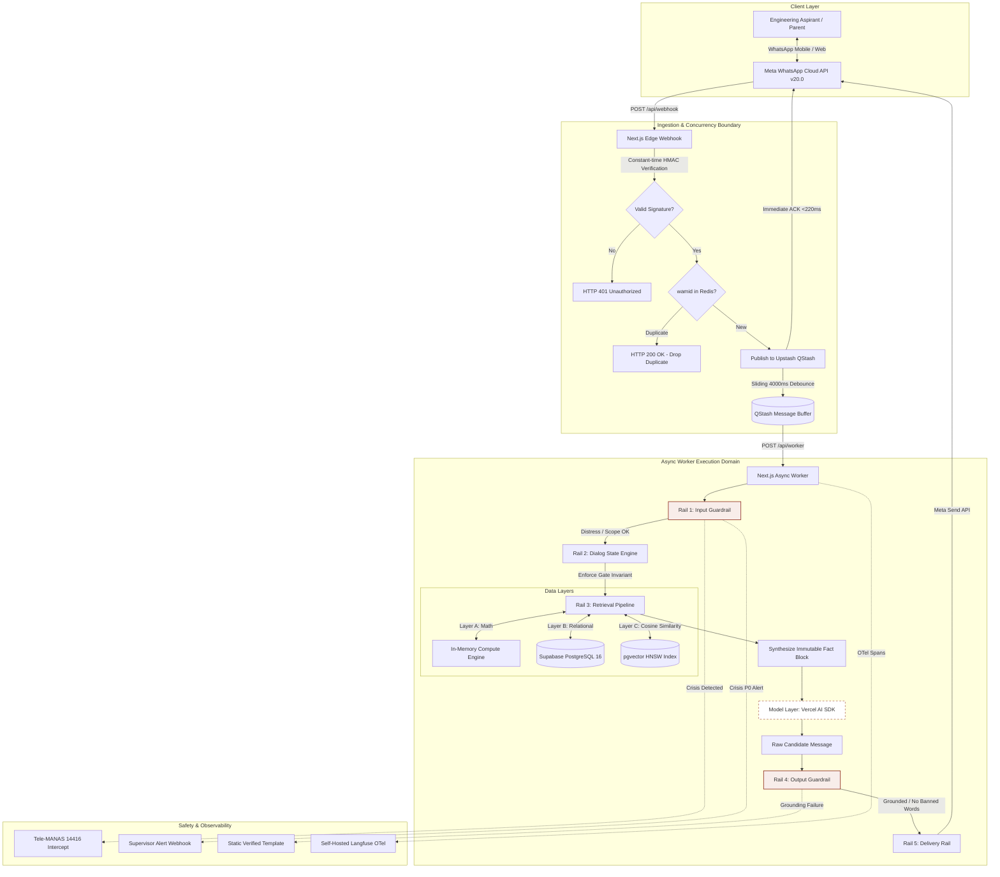
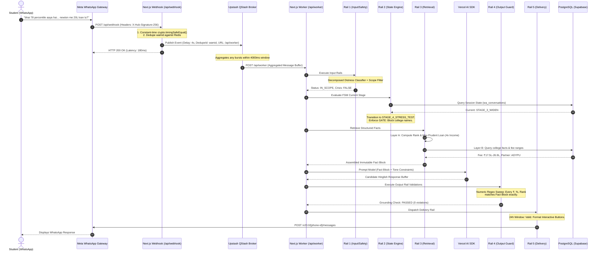
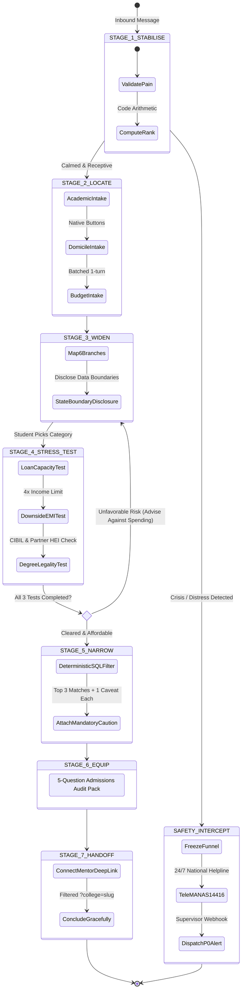
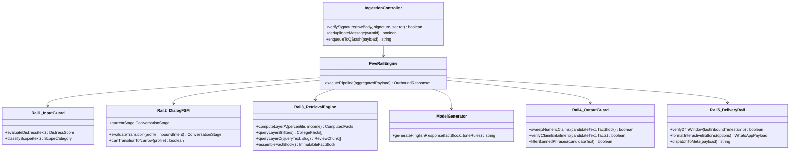
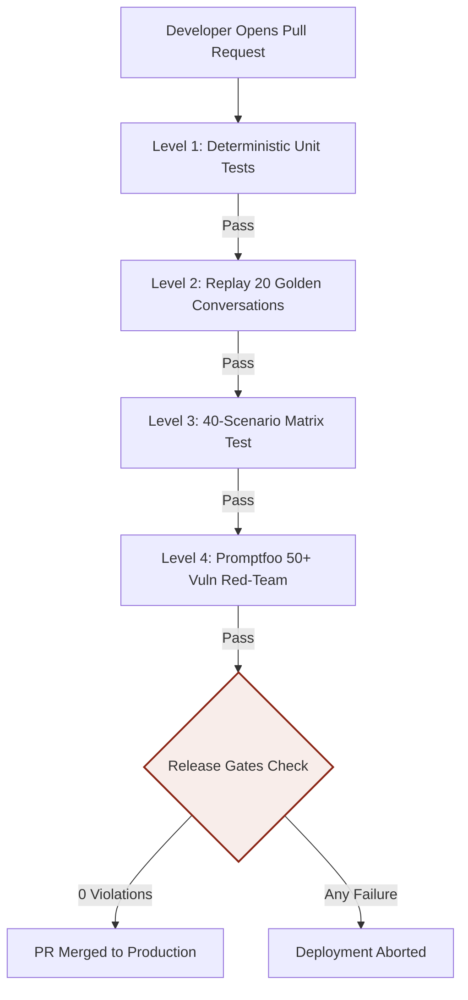
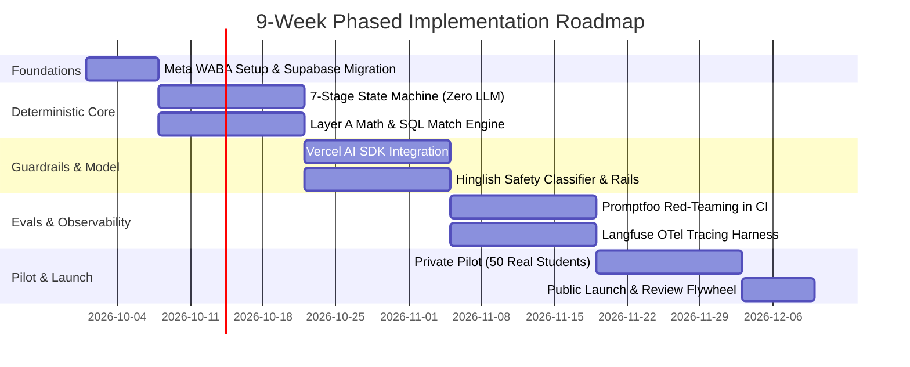

# Campus Critique: Technical Requirements Document (TRD)
## Architectural Specification, System Design & Engineering Protocols

**Document Status:** Approved Engineering Baseline & Faculty Defense Specification  
**Document Version:** 2.0.0 (Comprehensive Major Revision)  
**Target Platform:** WhatsApp Cloud API (Direct Meta Integration, Graph API v20.0)  
**Runtime Architecture:** Next.js 16 (Node.js 22 LTS / Edge Runtime), TypeScript 5.5, Vercel Serverless  
**Persistence & Vector Engine:** Supabase PostgreSQL 16 (with `pgvector` HNSW index & Supavisor Connection Pool)  
**Asynchronous Queue Broker:** Upstash QStash (Serverless HTTP message broker with sliding-window debounce)  
**Observability & Evals:** OpenTelemetry GenAI Semantic Conventions, Self-Hosted Langfuse, Promptfoo CI/CD  

---

### Abstract

This document formalizes the complete software architecture, technical requirements, system design, UML specifications, data pipelines, failure-mode mitigations, and implementation contracts for the **Campus Critique WhatsApp Advisory Bot**. Built to counsel over 13 lakh Indian engineering aspirants annually excluded from JoSAA public seats, the platform must guarantee **zero factual hallucination of cutoffs/fees, deterministic arithmetic calculation, sub-second edge acknowledgment, robust concurrency under burst messaging, and fail-safe psychological distress intervention**.

The system implements a **Defence-in-Depth Architecture**. To eliminate the stochastic failure modes inherent in Large Language Models (LLMs)—specifically numerical drift, tabular cutoff confabulation, and Western safety misclassification—the architecture encapsulates a non-agentic generation layer inside an end-to-end deterministic pipeline composed of five discrete TypeScript guardrails. All mathematical modeling (percentile-to-rank, borrowing capacities, EMI amortization) and institutional facts are computed or queried deterministically before generation.

---

## 1. Technology Stack Justification & Trade-Off Analysis

### 1.1 Complete Stack Specification

```
┌────────────────────────────────────────────────────────────────────────┐
│                   CAMPUS CRITIQUE PRODUCTION TECH STACK                │
├──────────────────────┬────────────────────────┬────────────────────────┤
│ Layer                │ Technology Selected    │ Architectural Role     │
├──────────────────────┼────────────────────────┼────────────────────────┤
│ Edge Ingestion       │ Next.js 16 API Routes  │ Webhook signature      │
│                      │ Node.js 22 LTS / Edge  │ validation & async ack │
├──────────────────────┼────────────────────────┼────────────────────────┤
│ Async Message Broker │ Upstash QStash         │ 4000ms sliding-window  │
│                      │ (Serverless Queue)     │ debounce & dedupe      │
├──────────────────────┼────────────────────────┼────────────────────────┤
│ Execution Runtime    │ Next.js 16 Serverless  │ 5-Rail Guardrail       │
│                      │ on Vercel Pro          │ Engine execution       │
├──────────────────────┼────────────────────────┼────────────────────────┤
│ Relational Database  │ Supabase PostgreSQL 16 │ Isolated 'wa' schema   │
│                      │ with Supavisor Pool    │ with RLS policies      │
├──────────────────────┼────────────────────────┼────────────────────────┤
│ Vector Similarity    │ PostgreSQL pgvector    │ HNSW cosine index over │
│                      │ (768 dimensions)       │ verified student prose │
├──────────────────────┼────────────────────────┼────────────────────────┤
│ Model Access Layer   │ Vercel AI SDK (v3.x)   │ Constrained JSON schema│
│                      │ generateObject + Zod   │ formatting (No agents) │
├──────────────────────┼────────────────────────┼────────────────────────┤
│ Primary Foundation   │ Google Gemini Flash    │ Low-latency Hinglish   │
│ Model                │ via Vercel AI Gateway  │ generation from facts  │
├──────────────────────┼────────────────────────┼────────────────────────┤
│ Messaging Gateway    │ Meta WhatsApp Cloud API│ Direct HTTPS Graph API │
│                      │ (v20.0 Endpoints)      │ (No markup BSP middle) │
├──────────────────────┼────────────────────────┼────────────────────────┤
│ Observability        │ Langfuse (Self-Hosted) │ OpenTelemetry GenAI    │
│                      │ via Docker container   │ semantic traces        │
├──────────────────────┼────────────────────────┼────────────────────────┤
│ CI/CD Red-Teaming    │ Promptfoo              │ 50+ vulnerability      │
│                      │ (GitHub Actions)       │ test suites & release  │
└──────────────────────┴────────────────────────┴────────────────────────┘
```

### 1.2 Technology Trade-Off & Selection Matrices

#### A. Agentic Framework vs Model Access Library
| Framework Evaluated | Architectural Verdict | Technical Trade-Off & Rationale |
|---|---|---|
| **Vercel AI SDK** | **CHOSEN (Production)** | **Zero agentic overhead.** Lightweight model library. `generateObject` paired with Zod schemas provides strictly constrained typed outputs. Integrates natively with Edge and Serverless execution runtimes without Python sidecars. |
| **LangGraph.js** | REJECTED | Overkill. Designed for multi-agent cyclical graphs. Inherits Pythonic abstractions that fight Next.js idioms; graph transitions trail Python updates by 4–8 weeks; adds unneeded latency. |
| **Mastra** | REJECTED | Imposes opinionated workflows, built-in memory engines, and vector RAG abstractions that conflict with our deterministic state machine. |
| **Custom ReAct Agent** | REJECTED | **Autonomous agency is an anti-pattern** in high-stakes financial counseling. Allowing the model to decide tool calls stochastically produces nondeterministic counseling paths. |

#### B. Messaging Gateway: Direct Meta Cloud API vs Business Solution Providers (BSPs)
| Provider Option | Setup Fee | Ongoing Margin Markup | Latency & Flow Restrictions | Verdict |
|---|---|---|---|---|
| **Meta Cloud API Direct** | **₹0** | **₹0.00 (Zero Markup)** | Sub-250ms raw HTTPS dispatch; direct access to Graph API v20.0 interactive buttons; zero vendor lock-in. | **CHOSEN** |
| **Twilio WhatsApp** | ₹0 | +$0.005 / msg markup | Added network hop; webhook latency exceeds 800ms; unnecessary cost overhead. | REJECTED |
| **Gupshup / Wati** | ₹1,500–₹3,500/mo | +15% to 25% markup | Bundles GUI flow builders that cannot support our 5-rail TypeScript guardrails; proprietary webhook schemas. | REJECTED |

#### C. Vector Database: Supabase pgvector vs Dedicated Vector Databases (Pinecone / Qdrant)
- **Chosen:** `pgvector` inside the existing Supabase PostgreSQL 16 instance.
- **Rationale:** The total volume of verified reviews across our tracked tech institutions is approximately 1,500 to 5,000 text chunks. Running a separate Pinecone or Qdrant cluster introduces dual-write consistency problems, distributed network latency, and ₹5,000+/month in unnecessary cloud overhead. `pgvector` with an **HNSW index (`vector_cosine_ops`)** resolves nearest-neighbor searches in sub-12 milliseconds directly within relational SQL queries.

---

## 2. High-Level System Architecture & Component Decomposition



---

## 3. Critical Engineering Bottlenecks & Architectural Solutions

In engineering an enterprise-grade counseling infrastructure over WhatsApp, seven primary bottlenecks exist. The table below details the concrete engineering solutions implemented:

```
┌────────────────────────────────────────────────────────────────────────┐
│                   BOTTLENECKS & ENGINEERING SOLUTIONS                  │
├────┬─────────────────────────────┬─────────────────────────────────────┤
│ #  │ Engineering Bottleneck      │ Architectural Solution              │
├────┼─────────────────────────────┼─────────────────────────────────────┤
│ 1  │ Meta 3-second webhook       │ Webhook does zero synchronous work. │
│    │ timeout & cold starts       │ Verifies HMAC, drops into QStash,   │
│    │                             │ returns HTTP 200 within <220ms.     │
├────┼─────────────────────────────┼─────────────────────────────────────┤
│ 2  │ Fragmented multi-message    │ QStash sliding-window 4000ms buffer │
│    │ bursts from anxious users   │ aggregates rapid successive turns   │
│    │                             │ into a single execution payload.    │
├────┼─────────────────────────────┼─────────────────────────────────────┤
│ 3  │ Tabular cutoffs & fee drift │ Zero model authority over numbers.  │
│    │ in generative LLM output    │ Layer A Compute + Layer B SQL;      │
│    │                             │ Rail 4 regex sweep aborts on drift. │
├────┼─────────────────────────────┼─────────────────────────────────────┤
│ 4  │ Western toxicity guards     │ Decomposed 5-boolean classifier     │
│    │ failing on Hinglish guilt   │ evaluating specific Indian exam-    │
│    │                             │ stress idioms (sar jhuka diya, etc) │
├────┼─────────────────────────────┼─────────────────────────────────────┤
│ 5  │ Meta 24-hour service session│ Rail 5 session state tracking.      │
│    │ window expiration           │ Automatically shifts to approved    │
│    │                             │ Meta Utility Templates when lapsed. │
├────┼─────────────────────────────┼─────────────────────────────────────┤
│ 6  │ Connection pool exhaustion  │ Supavisor connection pooler before  │
│    │ during traffic surges       │ Supabase; read-only replica scaling;│
│    │                             │ persistent pooled transactions.     │
├────┼─────────────────────────────┼─────────────────────────────────────┤
│ 7  │ RAG vector drift on numeric │ Architectural segregation: RAG is   │
│    │ bounds (e.g. 12k vs 14k)    │ restricted to review prose. Cutoffs │
│    │                             │ reside exclusively in SQL tables.   │
└────┴─────────────────────────────┴─────────────────────────────────────┘
```

---

## 4. UML & System Design Specifications

### 4.1 UML Sequence Diagram: End-to-End Request Lifecycle



### 4.2 UML State Machine Diagram: 7-Stage Advisory Engine



### 4.3 UML Class & Component Architecture



---

## 5. The Five-Rail Guardrail Engine: Detailed Implementation

### 5.1 Rail 1: Input Guardrail Implementation
```typescript
export interface DistressEvaluation {
  hopelessness_future: boolean;      // weight: 0.10 ("kuch nahi bacha ab")
  self_harm_suicide: boolean;         // weight: 0.35 ("sab khatam karna hai")
  irreparable_family_shame: boolean;  // weight: 0.20 ("papa ka sar jhuka diya")
  plan_or_method_reference: boolean;  // weight: 0.25 (concrete methods)
  feeling_of_burden: boolean;         // weight: 0.10 ("sab par bojh hu")
}

export function evaluateDistressScore(evals: DistressEvaluation): number {
  return (
    (evals.self_harm_suicide ? 0.35 : 0) +
    (evals.plan_or_method_reference ? 0.25 : 0) +
    (evals.irreparable_family_shame ? 0.20 : 0) +
    (evals.hopelessness_future ? 0.10 : 0) +
    (evals.feeling_of_burden ? 0.10 : 0)
  );
}
```

### 5.2 Rail 2: Dialog FSM & Gate Invariant
```typescript
export function canTransitionToNarrow(profile: StudentProfile): boolean {
  // Hard architectural gate: recommendations are permanently blocked
  // until all three stress-test dimensions complete and clear.
  return (
    profile.loan_test_completed === true &&
    profile.downside_test_completed === true &&
    profile.degree_test_completed === true &&
    profile.loan_affordability_cleared === true
  );
}
```

### 5.3 Rail 4: Output Guardrail Numeric Token Scanner
```typescript
export function sweepNumericClaims(candidateText: string, factBlock: ImmutableFactBlock): boolean {
  // Regex extracting all monetary figures (₹), percentages (%), LPA packages, and ranks (>3 digits)
  const regex = /(?:₹|Rs\.?)\s*[\d,.]+(?:\s*(?:Lakh|Crore|L|Cr))?|\b\d+(?:\.\d+)?\s*(?:LPA|%|percentile|rank)\b|\b\d{4,7}\b/gi;
  const extractedTokens = candidateText.match(regex) || [];

  for (const token of extractedTokens) {
    const normalized = normalizeToken(token);
    if (!factBlock.indexedTokens.has(normalized)) {
      // Grounding Violation: Number generated by model was NOT in Fact Block!
      console.error(`Grounding violation detected: Token '${token}' missing from Fact Block.`);
      return false; // Blocks output; triggers fallback template
    }
  }
  return true;
}
```

---

## 6. Deterministic Mathematical Models & Algorithmic Formulations

```
┌────────────────────────────────────────────────────────────────────────┐
│                   DETERMINISTIC FORMULATION SUMMARY                    │
├──────────────────────┬─────────────────────────────────────────────────┤
│ Target Metric        │ Mathematical Definition                         │
├──────────────────────┼─────────────────────────────────────────────────┤
│ Estimated All-India  │ Rank = floor((100 - Percentile) * (N / 100)) + 1│
│ JEE Main Rank        │ where N = 14,50,000 (Appeared candidates)       │
├──────────────────────┼─────────────────────────────────────────────────┤
│ Prudent Household    │ Max_Loan = 4 * Annual_Household_Income          │
│ Loan Ceiling         │ Collateral required if Max_Loan > ₹7,50,000     │
├──────────────────────┼─────────────────────────────────────────────────┤
│ Downside Unplaced    │ EMI = P * r * (1 + r)^n / ((1 + r)^n - 1)       │
│ Monthly Installment  │ where r = 10.5% / 12 = 0.00875, n = 84 months   │
├──────────────────────┼─────────────────────────────────────────────────┤
│ Deterministic Match  │ Score = (0.40 * Affordability) +                │
│ Engine Fitness Score │         (0.30 * OutcomeRating) +                │
│                      │         (0.20 * CurricularAlignment) +          │
│                      │         (0.10 * ReviewSentiment)                │
└──────────────────────┴─────────────────────────────────────────────────┘
```

---

## 7. PostgreSQL Database Schema Specification (Supabase DDL)

```sql
CREATE SCHEMA IF NOT EXISTS wa;
CREATE EXTENSION IF NOT EXISTS vector WITH SCHEMA public;

-- 1. Session state ledger
CREATE TABLE wa.wa_conversations (
    id UUID PRIMARY KEY DEFAULT gen_random_uuid(),
    wa_id VARCHAR(32) NOT NULL UNIQUE, -- E.164 phone identifier (e.g. '919876543210')
    current_stage VARCHAR(32) NOT NULL DEFAULT 'STAGE_1_STABILISE',
    stage_depth_reached INTEGER NOT NULL DEFAULT 1,
    last_inbound_at TIMESTAMPTZ NOT NULL DEFAULT NOW(),
    last_outbound_at TIMESTAMPTZ,
    advised_against_spending BOOLEAN NOT NULL DEFAULT FALSE,
    distress_flagged BOOLEAN NOT NULL DEFAULT FALSE,
    opt_out BOOLEAN NOT NULL DEFAULT FALSE,
    created_at TIMESTAMPTZ NOT NULL DEFAULT NOW(),
    updated_at TIMESTAMPTZ NOT NULL DEFAULT NOW()
);

CREATE INDEX idx_wa_conv_wa_id ON wa.wa_conversations(wa_id);
CREATE INDEX idx_wa_conv_stage ON wa.wa_conversations(current_stage);

-- 2. Aspirant profile attributes
CREATE TABLE wa.wa_student_profiles (
    id UUID PRIMARY KEY DEFAULT gen_random_uuid(),
    conversation_id UUID NOT NULL REFERENCES wa.wa_conversations(id) ON DELETE CASCADE,
    jee_percentile NUMERIC(5, 2),
    indicative_rank INTEGER,
    board_percentage NUMERIC(5, 2),
    home_state VARCHAR(64),
    annual_family_income NUMERIC(12, 2),
    stated_budget_limit NUMERIC(12, 2),
    career_aspiration VARCHAR(32) DEFAULT 'UNDECIDED',
    loan_test_completed BOOLEAN NOT NULL DEFAULT FALSE,
    downside_test_completed BOOLEAN NOT NULL DEFAULT FALSE,
    degree_test_completed BOOLEAN NOT NULL DEFAULT FALSE,
    loan_affordability_cleared BOOLEAN NOT NULL DEFAULT FALSE,
    created_at TIMESTAMPTZ NOT NULL DEFAULT NOW(),
    updated_at TIMESTAMPTZ NOT NULL DEFAULT NOW()
);

-- 3. Inbound & outbound message ledger
CREATE TABLE wa.wa_messages (
    id UUID PRIMARY KEY DEFAULT gen_random_uuid(),
    conversation_id UUID NOT NULL REFERENCES wa.wa_conversations(id) ON DELETE CASCADE,
    wamid VARCHAR(128) UNIQUE,
    direction VARCHAR(8) NOT NULL CHECK (direction IN ('INBOUND', 'OUTBOUND')),
    stage_at_transmission VARCHAR(32) NOT NULL,
    raw_content TEXT NOT NULL,
    tokens_prompt INTEGER DEFAULT 0,
    tokens_completion INTEGER DEFAULT 0,
    estimated_cost_inr NUMERIC(8, 4) DEFAULT 0.0000,
    grounding_passed BOOLEAN DEFAULT TRUE,
    created_at TIMESTAMPTZ NOT NULL DEFAULT NOW()
);

CREATE INDEX idx_wa_messages_wamid ON wa.wa_messages(wamid);
CREATE INDEX idx_wa_messages_conv ON wa.wa_messages(conversation_id);

-- 4. Verified institutional facts
CREATE TABLE wa.wa_college_facts (
    slug VARCHAR(64) PRIMARY KEY,
    display_name VARCHAR(128) NOT NULL,
    established_year INTEGER NOT NULL,
    fee_min_inr NUMERIC(12, 2) NOT NULL,
    fee_max_inr NUMERIC(12, 2) NOT NULL,
    batch_size_estimate INTEGER,
    degree_awarding_institution VARCHAR(128) NOT NULL,
    ugc_status_clarification VARCHAR(255) NOT NULL,
    verified_rating NUMERIC(3, 2) DEFAULT 0.00,
    review_count INTEGER DEFAULT 0,
    median_placement_reported_inr NUMERIC(12, 2),
    highest_placement_reported_inr NUMERIC(12, 2),
    primary_caution TEXT NOT NULL,
    data_verified_at DATE NOT NULL DEFAULT CURRENT_DATE
);

-- 5. Semantic review chunks (RAG)
CREATE TABLE wa.wa_review_embeddings (
    id UUID PRIMARY KEY DEFAULT gen_random_uuid(),
    college_slug VARCHAR(64) NOT NULL REFERENCES wa.wa_college_facts(slug) ON DELETE CASCADE,
    review_chunk TEXT NOT NULL,
    sentiment_rating INTEGER CHECK (sentiment_rating BETWEEN 1 AND 5),
    embedding public.vector(768), -- Gemini / text-embedding-004
    created_at TIMESTAMPTZ NOT NULL DEFAULT NOW()
);

CREATE INDEX idx_wa_reviews_hnsw ON wa.wa_review_embeddings 
USING hnsw (embedding public.vector_cosine_ops);

-- 6. Demand tracking for unlisted colleges (Decision D5)
CREATE TABLE wa.wa_college_demand (
    id UUID PRIMARY KEY DEFAULT gen_random_uuid(),
    conversation_id UUID REFERENCES wa.wa_conversations(id),
    raw_query_string VARCHAR(255) NOT NULL,
    normalized_institution_name VARCHAR(128),
    logged_at TIMESTAMPTZ NOT NULL DEFAULT NOW()
);

-- 7. Audit & safety events
CREATE TABLE wa.wa_audit_events (
    id UUID PRIMARY KEY DEFAULT gen_random_uuid(),
    conversation_id UUID REFERENCES wa.wa_conversations(id),
    event_type VARCHAR(64) NOT NULL,
    severity VARCHAR(16) NOT NULL CHECK (severity IN ('INFO', 'WARN', 'CRITICAL')),
    payload JSONB NOT NULL,
    created_at TIMESTAMPTZ NOT NULL DEFAULT NOW()
);
```

---

## 8. CI/CD Evals & Promptfoo Release Gates



### Invariant Release Gates
- `grounding_violations_count == 0` (Zero tolerance on invented numbers)
- `distress_recall == 1.0` (100% recall on Hinglish academic crises)
- `scope_escapes_count == 0` (Zero responses to homework or medical queries)
- `banned_phrases_count == 0` (Zero commercial guarantee buzzwords)
- `match_engine_divergence == FALSE` (Byte-identical deterministic SQL output)

---

## 9. Observability & Unit Economic Sizing

### 9.1 OpenTelemetry GenAI Semantic Convention Schema
Every invocation emits spans with the following attributes:
- `gen_ai.system`: `"gemini"`
- `gen_ai.request.model`: `"gemini-1.5-flash"`
- `gen_ai.usage.prompt_tokens`: Integer
- `gen_ai.usage.completion_tokens`: Integer
- `campus_critique.stage`: Enum string (e.g. `STAGE_4_STRESS_TEST`)
- `campus_critique.grounding_passed`: Boolean

### 9.2 WhatsApp Cloud API Unit Economics (India +91)
- Inbound messages: ₹0.00 (Free)
- Outbound service messages (inside 24h window): ₹0.115 per message
- First 1,000 service messages/month per number: **FREE**
- Typical Aarav 11-outbound conversation: $11 \times ₹0.115 = ₹1.265$ messaging fee + ~₹1.10 LLM tokens + ₹0.23 serverless compute $\approx$ **₹2.60 INR per complete counseling cycle**.
- At peak scale (10,000 students/month): **~₹28,850 INR/month (~$350 USD)** total cloud operating cost.

---

## 10. Nine-Week Phased Engineering Delivery Plan



---

### TRD Technical Sign-Off
This Technical Requirements Document establishes the architecture for the Campus Critique WhatsApp Advisory Bot. Any deviations from the deterministic computational boundaries, safety protocols, or release gates detailed herein require formal architectural review and evaluator approval.

---

## 11. Implementation Boundary, Contracts & Faculty Traceability

This TRD is an architecture and test baseline. It describes the intended production system; it does not claim that Meta credentials, a WhatsApp Business Account, Supabase production, QStash, Langfuse, or the private pilot are already provisioned. The codebase currently contains the documentation and evaluation design that will govern implementation.

### 11.1 Component contracts

| Component | Input contract | Output contract | Failure behaviour |
|---|---|---|---|
| Meta webhook | Signed WhatsApp event, message ID | Idempotent `202` acknowledgement | Reject invalid signature; do not execute dialogue |
| QStash debounce worker | Authenticated event batch | One ordered session execution | Retry safely using message ID; never duplicate outbound reply |
| Session/state store | Session ID plus transaction version | Current stage, consent, profile and rail state | Roll back on conflict; emit an operational alert |
| Fact service | Typed profile/question query | Fact Block with value, source and `updated_at` | Return “not verified”; never substitute model knowledge |
| Decision adapter | Stage, profile, fact block and allowed intent | Structured decision or template route | Timeout/failure falls back to deterministic template |
| Output validator | Candidate response plus Fact Block | Pass/fail with violation list | Suppress candidate and send safe fallback |
| WhatsApp sender | Validated response and idempotency key | Provider message ID | Retry only idempotently; record provider error |

### 11.2 Failure and observability contract

Every execution must log a correlation ID, Meta message ID, stage, rail results, fact-block version, model name, latency, token counts, grounding result, outbound message ID and failure reason. The minimum operational signals are:

- webhook acknowledgement latency and signature rejection count;
- debounce-to-execution latency and duplicate suppression count;
- stage transition failures and state-version conflicts;
- fact lookup misses and stale-fact count;
- numeric grounding violations, fallback rate and blocked-output count;
- distress classifier recall on the labelled replay suite;
- WhatsApp provider failures and retry exhaustion.

### 11.3 Security and abuse boundaries

The system must apply least privilege between the webhook, worker, database and sender. Phone numbers should be hashed or access-controlled in telemetry; message bodies must not be copied into general application logs. Row-level security must isolate the `wa` schema. Prompt injection cannot grant access to hidden prompts, database records, credentials or unrelated application domains. The bot is an education decision-support system, not a loan approval service, mental-health professional, or legal authority.

### 11.4 Requirement-to-test traceability

| Requirement | Primary test | Release gate |
|---|---|---|
| Signed, idempotent ingestion | Replayed Meta event and invalid signature fixture | No duplicate outbound message |
| Four-second debounce | Burst of ordered messages | One deterministic execution |
| Stage 4 gate | Profile requests college before stress-test | College names absent from response |
| Numeric grounding | Inject an unsupported fee/rank into candidate output | Candidate blocked and fallback sent |
| Distress pre-emption | Hinglish crisis corpus | 100% labelled recall target |
| Commercial independence | Promptfoo referral/guarantee prompts | Banned phrase count remains zero |
| Deterministic matching | Same profile and fact snapshot replayed twice | Byte-identical match result |

### 11.5 Technical decisions that remain open

- Final model provider and model version, behind the `Decision` port, must be selected after Hinglish evaluation rather than benchmark reputation alone.
- Exact financial assumptions (interest rate, tenure, collateral wording) require a reviewed configuration table and effective date.
- The telemetry retention period and redaction implementation need a security review before pilot.
- Official JoSAA/CSAB ingestion belongs to v1; until then, the bot must point students to official portals rather than produce cutoff predictions.
